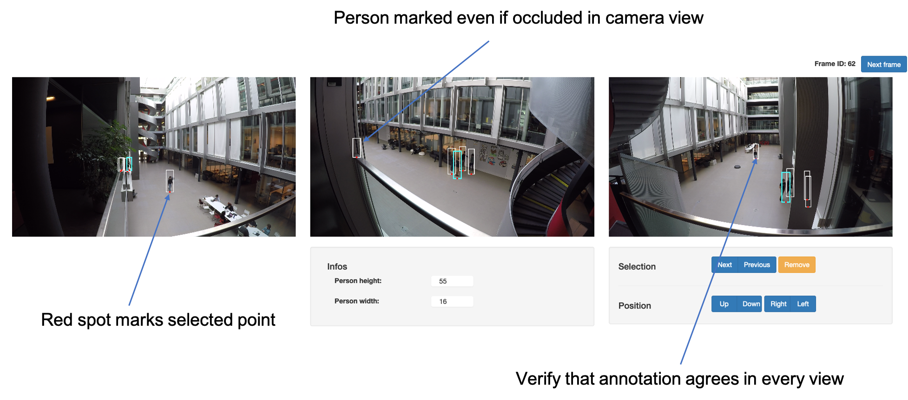

# 1 - Annotation

This module take the full camera calibration and the raw video footage. It extract a training and validation set of interesting frames. These frames are then annotated with the multiview annotation tool.

## Input
* `data/0-calibration`
* `data/raw_data/footage`

## Output

* `data/1-annotation/train`
* `data/1-annotation/val`
* `data/1-annotation/labels/train`
* `data/1-annotation/labels/val` (optional)
* `data/1-annotation/visualization`


### 0-annotation_setup.py

Example command 
`python 0-annotation_setup.py -cfg path_to_project_confi.yaml --num_train_sample 1200 --val_seq_length 300`

Arguments: 
* `--num_train_sample` Number of training sample. Default=1000
* `--val_seq_length`  Length of validation sequence (in nb of frame). Default=100
* `--val_seq_start` Index of the first frame of the validation sequence of length val_seq_length, if set to default (-1) the validation sequence is automatically selected. 

### 1-annotate_train.sh

Example command 
`sh 1-annotate_train.sh -cfg path_to_project_confi.yaml`

Launches an annotation tool to annotate the training frames. Navigate to 'localhost:8080' to annotate the training frames. At the end of the annotation process the annotations are saved to 'data/1-annotation/labels/train'. Once completed the webserver can be shutdown.



Once this step is completed the training annotation should be present in `data/1-annotation/labels/train`

### 2-annotate_val.sh

This step is optional, the goal is to annotate a continuous sequence for validation purpose. If provided it will be used to select the best model during training and to compute tracking metrics.

Example command 
`sh 2-annotate_val.sh -cfg path_to_project_confi.yaml`

Start a webserver which can be use to annotate the validation sequence, once completed the webserver can be shutdown.
Once this step is completed the validation annotation should be present in `data/1-annotation/labels/val`

### 3-post_process_annotations.py
Visualize the validation sequence for the different view and in the groundplane. If it has been annotated it also overlay the annotation on top of the video.

Example command 
`python 3-post_process_annotations.py -cfg path_to_project_confi.yaml`

Output can be found in `data/1-annotation/visualization`

### Annotation format


The annotation both for validation and training are stored in the following json format.
In the following step of the pipeline only the value Xw, Yw, Zw from the training annoataion are used. The validation on top of those three value also uses personID

```json
[
    [
        "rectID",
        "personID",
        "modified",
        "Xw",
        "Yw",
        "Zw",
        "a1",
        "b1",
        "c1",
        "d1",
        "a2",
        "b2",
        "c2",
        "d2",
        "a3",
        "b3",
        "c3",
        "d3"
    ],
    [
        "365_1737",
        1,
        true,
        365.904296875,
        1737.040283203125,
        0,
        1378,
        138,
        1413,
        269,
        792,
        32,
        930,
        408,
        210712,
        338,
        292717,
        101358
    ],
    [
        "38_1564",
        2,
        true,
        38.15412902832031,
        1564.7142333984375,
        0,
        1108,
        124,
        1148,
        256,
        1590,
        36,
        1688,
        416,
        24094,
        -2339,
        28686,
        4132
    ]
]
```
