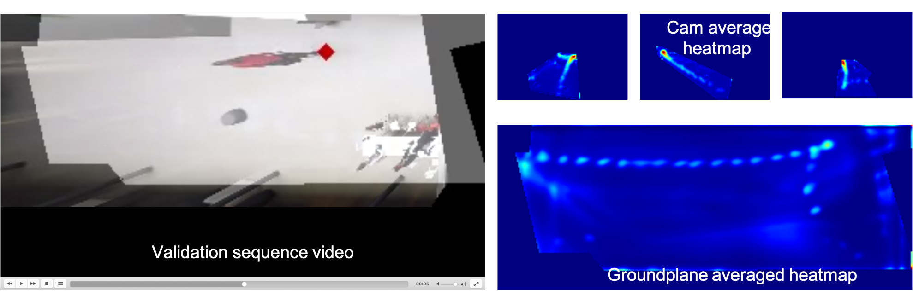

# 2 - Training

This module take the full camera calibration and the annotated training (and validation) set. It first check and display information about the previous steps. If those information are correct, the user can process with training the model. Once the model is trained, the best parameter of the model are stored in `data/2-training/weights/best_checpoint.pth.tar`. The following step validate this checkpoint on the validation sequence and generate visualization (video and heatmap average).

## Input
* `data/0-calibration`
* `data/1-annotation/train`
* `data/1-annotation/val`
* `data/1-annotation/labels/train`
* `data/1-annotation/labels/val` (optional)

## Output

* `data/2-training/weights`
* `data/2-training/logs`
* `data/2-training/model_evaluation.hdf5`
* `data/2-training/visualization`

### 0-check_data.py

This command check and display the results of the previous step. The number of annotated training and validation frames should correspond with what was done in the previous step

Example command 
`python 0-check_data.py -cfg path_to_project_confi.yaml`

### 1-start_training.py
This command start the training process.

Example command 
`python 1-start_training.py -cfg path_to_project_confi.yaml -tcfg path_to_train_config.yaml`

Arguments: 
`-tcfg` `--train_config_file` Path to train config file, can be used to ovewrite all the training parameter used in `detection/configs/arguments.py`

Once completed the best model checkpoint should be stored in `data/2-training/weights`

### 2-validate_best_checkpoint.py

Once the training is completed we test the best checkpoint on the validation sequence.

Example command 
`python 2-validate_best_checkpoint.py -cfg path_to_project_confi.yaml -tcfg path_to_train_config.yaml`

The generated detection for the validation sequence are stored in `data/2-training/model_evaluation.hdf5`.

### 3-visualize_sequence.py

This step generate a video in the groundplane of the validation sequence overlaid with the generated detection from the previous step.
It also generate average heatmap over the complete validation sequence.

Example command 
`python 3-visualize_sequence.py -cfg path_to_project_confi.yaml -tcfg path_to_train_config.yaml`

The generate video is saved in  `data/2-training/visualization`