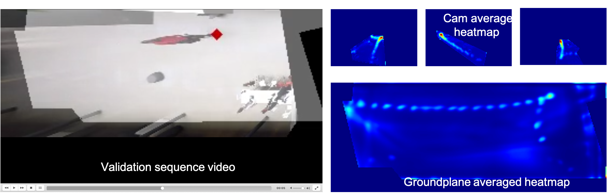

# 3 - Inference

This module take the full camera calibration, the raw video sequence, and the best model checkpoints. It run the model and the full sequence and store the detection and heatmaps in and HDF5 format.

## Input
* `data/raw_data/`
* `data/0-calibration`
* `data/2-training/weights`

## Output

* `data/3-inference/model_inference.hdf5`
* `data/3-inference/visualisation`

### 0-run_inference.py

This command run the inference on the full sequence. Since those sequence can be quite long it is designed to automatically restart where it left off if interupted before completion.

Example command 
`python 0-run_inference.py -cfg path_to_project_confi.yaml`

The output detection and heatmaps (in the groundplane and for each view) are stored in `data/3-inference/model_inference.hdf5`

### 1-visualize_sequence.py

This command take the detection and heatmaps generate above and generate the visualization for the specified frames range.

Example command 
`python 1-visualize_sequence.py -cfg path_to_project_confi.yaml --inference_visualize 1000 1500`

Arguments: 
* `-iv`, `--inference_visualize` Starting end ending index of the range of frame to visualize.
* `-dt`, `--detection_threshold`  By default the detection are automatically thresholded to keep only relevant detection, if too many noisy detection still remains it is possible to manually define a threshold. Value bigger than one will remove detection with score lower than threshold.

The generate video is saved in  `data/3-inference/visualization`