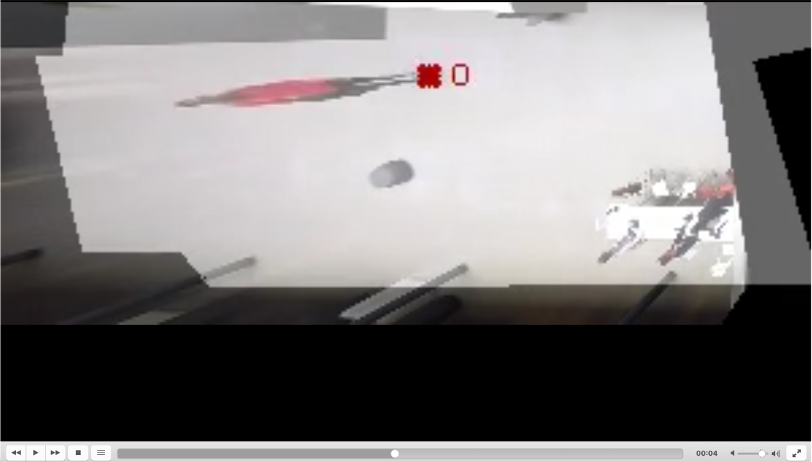

# 4 - Tracking
This model take the output of the inference, detection and appearance features. It run a tracker (muSSP) on those detection in order to reconstruct a set of tracks where each track should correspond to a unique person.

## Input
* `data/2-training/model_evaluation.hdf5`
* `data/3-inference/model_inference.hdf5`

## Output

* `data/4-tracking/model_frames_B_E_tracking_evaluation.hdf5`
* `data/4-tracking/model_frames_B_E_tracking_inference.hdf5`
* `data/4-tracking/visualization`

### 0-run_tracker.py

This command run the muSSP tracker on output of the previous inference step (validation or inference), it generate a set of tracks store in the HDF5 format.

Example command 
`python 0-run_tracker.py -cfg path_to_project_confi.yaml --tracker_range 500 900`

Arguments: 
* `--mode` inference of validation to select the sequence on to which apply the tracker
* `--tracker_range` Starting end ending index of the range of frame to run the tracker on.
* `--tracker_step` Window size of the tracker, wihtin a given windows the tracker extract tracklet from detection, the trackelt of all the windows are then merged to form the final tracks, larger value are slower, but can improve tracker accuracy.
* `--reid` By default the tracker doesn't use appearance feature, by using this argument it will use them.

tracker range is also used to name the output file storing the tracks, it should be consistent between step 0 and 1 of the tracking module.
The output tracks (in the groundplane) are stored in `data/4-tracking/*.hdf5`

### 1-visualize_sequence.py

This command take the detection and heatmaps generate above and generate the visualization for the specified frames range.

Example command 
`python 1-visualize_sequence.py -cfg path_to_project_confi.yaml --tracker_range 500 900 --tracker_visualize 600 700`

Arguments: 
* `--tracker_range` Starting end ending index of the range of frame to run the tracker on.
* `--mode` inference of validation to select the sequence on to which apply the tracker
* `--tracker_visualize` Starting end ending index of the range of frame to visualize the tracking results.
* `--metric_threshold` Threshold in pixel (in the groundplane) use to compute the tracking metric, if resolution of groundplane is increased the threshold should be increased accordingly.

The generated video is saved in  `data/3-inference/visualization`